### Steps to work the simulator 

1. Click on the simulator tab to start the simulation. A short overview of the experiment is provided. Users can read and understand the experiment concepts before beginning the simulator. After understanding the concepts clearly, click on the “Begin Experiment” button.

  

&nbsp;

2. Users can view and perform Equipment Familiarization. Click on each equipment component to get a brief explanation of each equipment.

  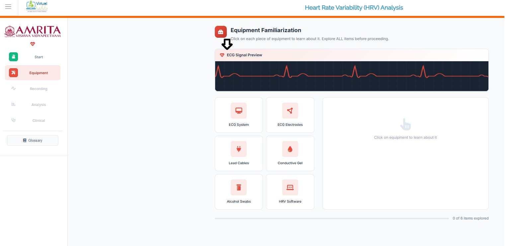

&nbsp;
 
3. When completing the six components provided in the simulator window, click on the Continue to recording button to study HRV and its recording processes. 

  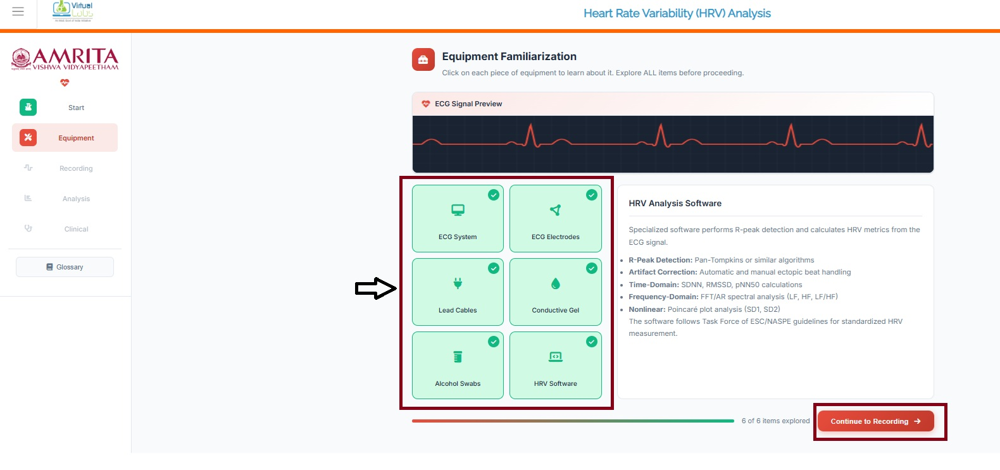

&nbsp;
  
4. The user can observe different subject conditions such as Relaxed state, Mental stress, post-exercise, and cardiac condition. Click on any of the subject conditions to proceed with the experiment.

  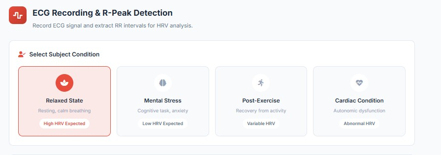

&nbsp;
 
5. Here, the relaxed state is selected to work out the simulator. User can monitor the ECG signal in the simulator window. The respective heart rate and time elapsed between two successive R-wave peaks on an ECG, representing the duration between heartbeats (RR) are also displayed. Click on “Start recording: button to record the ECG of the selected subject condition. 

  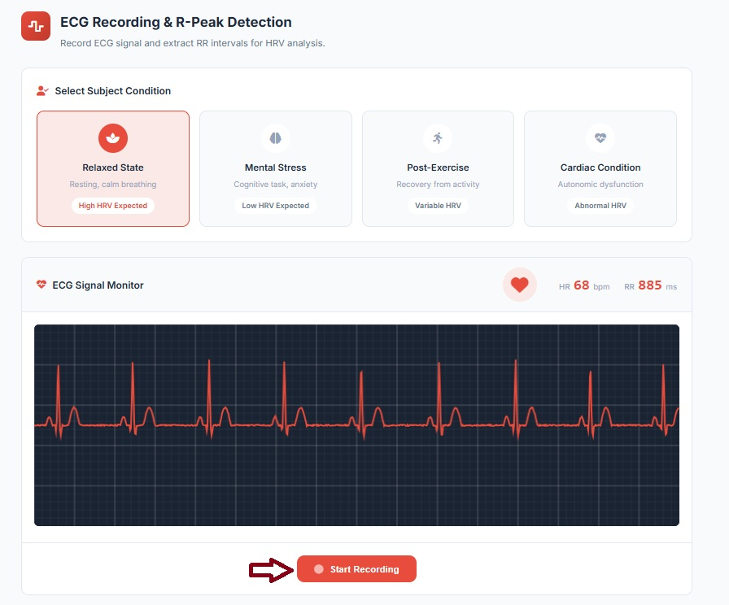

&nbsp;
  
6. The user can visualize the ECG waveform along with the corresponding recording time scale.

  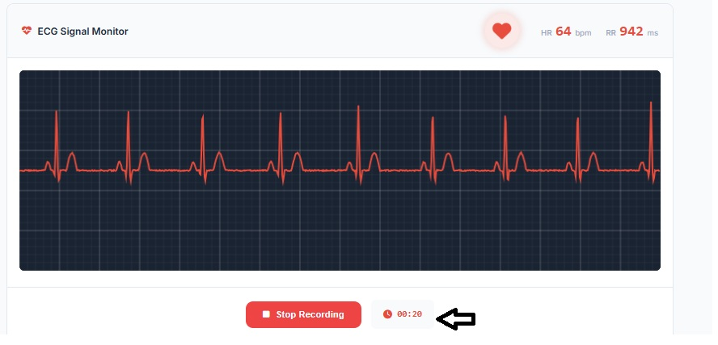

&nbsp;
  
7. Next, click on the stop recording button. A 20-second ECG signal is captured for analysis. Users can then observe the corresponding RR interval tachogram plot derived from the recorded signal.

  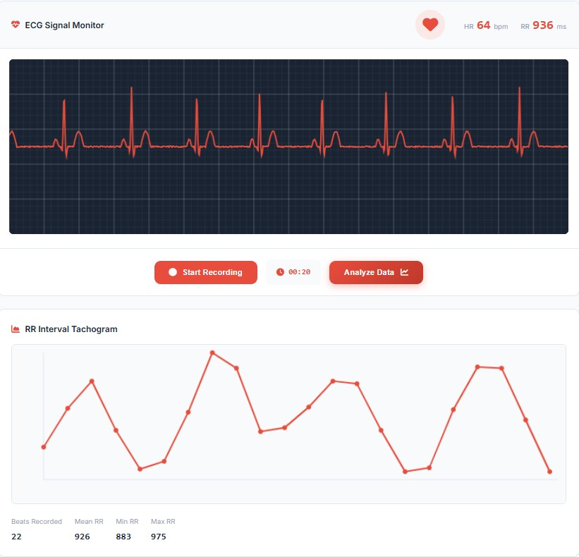

&nbsp;
  
8. Click on Analyze data for further analysis of the recorded ECG signal.

  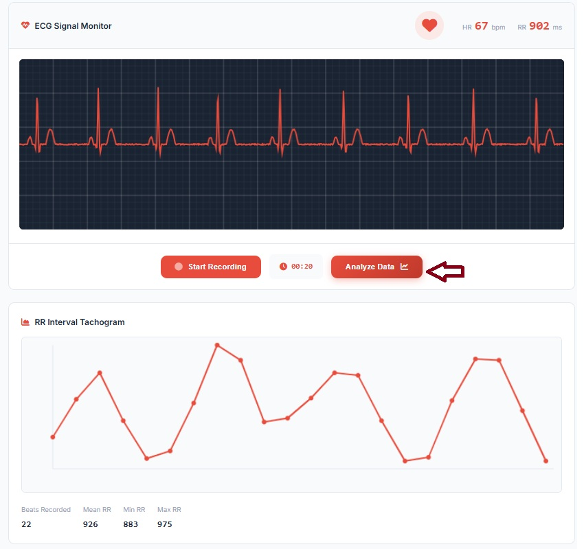

&nbsp;

9. The time domain, frequency domain and nonlinear analysis were displayed in the simulator window. Users can choose the respective domains to observe the results. In the time-domain analysis, distribution of RR intervals is  statistically represented  through a histogram. It provides insight into beat-to-beat variability and autonomic regulation of the heart.

  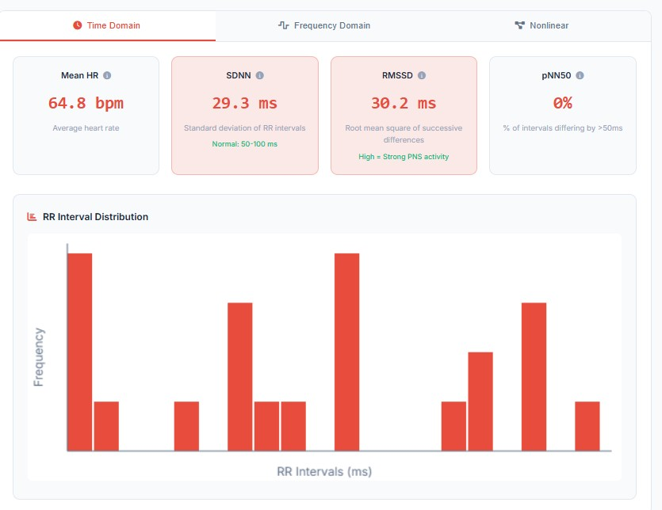

&nbsp;

10. The frequency domain  typically performed using spectral analysis methods such as Fast Fourier Transform (FFT) or autoregressive modelling. It represents how the variance in RR intervals is distributed across different frequency bands, providing insights into autonomic nervous system (ANS) regulation. The LF/HF ratio indicates the of autonomic balance. 

  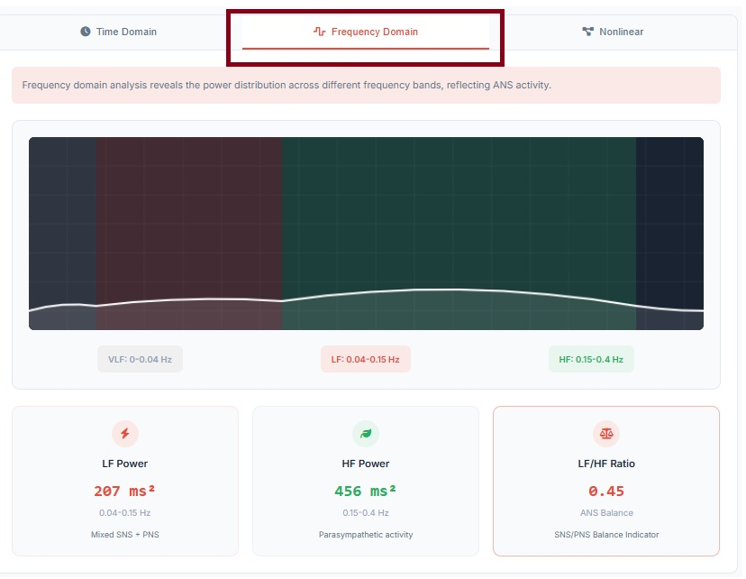

&nbsp;

11. The nonlinear analysis examines the complex, irregular, and chaotic behavior of heart rhythms that cannot be fully captured time and frequency domain analysis. The Poincaré Plot is a  scatter plot of each RR interval against the next and it  provides a visual representation of beat-to-beat variability. 

  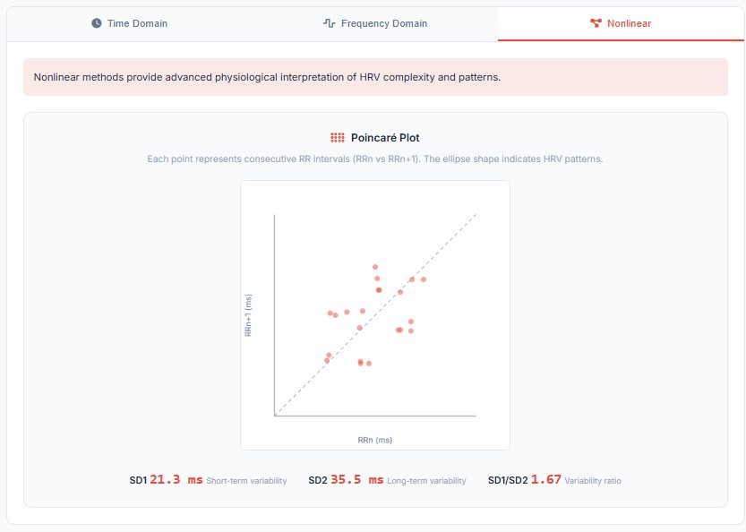

&nbsp;
  
12. To understand the clinical implications of the HRV analysis, users can click on View clinical interpretation button. 

  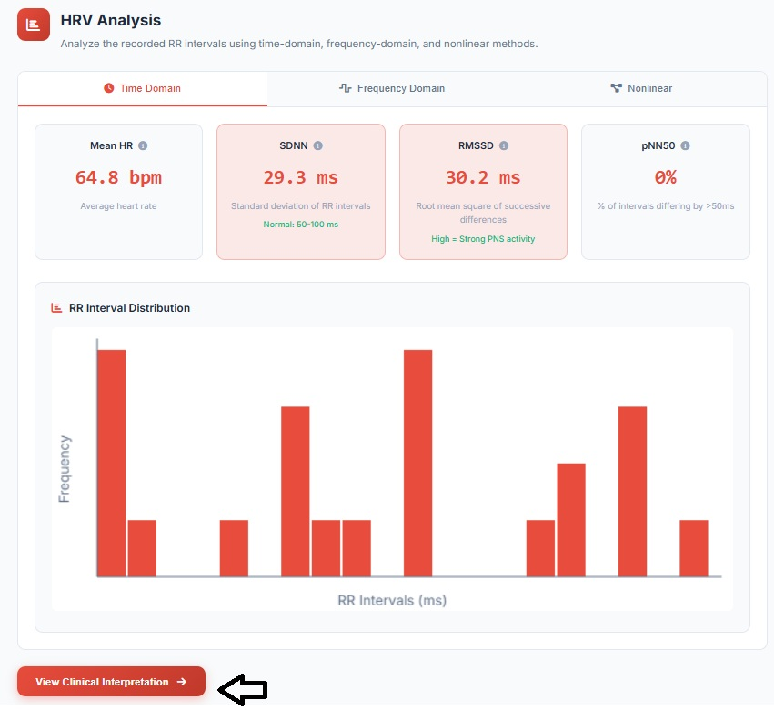

&nbsp;

13. The result interpretation of the HRV analysis is displayed and the users can map this interpretation guide while experimenting on a real-time basis. The analysis summary presents detailed information about the ECG signal recorded during the simulation. 

  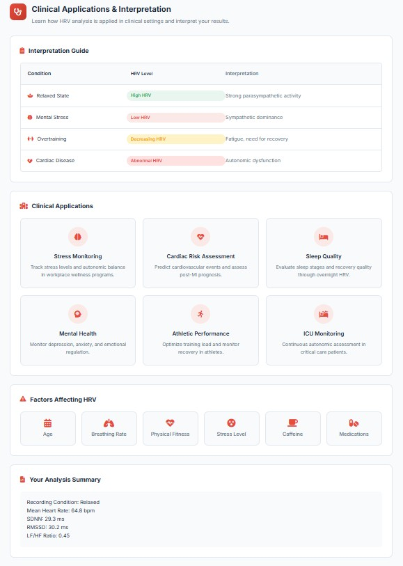

&nbsp;

14.	The user can click on the “Glossary” tab at any point during  the simulation access an overview of key terms, their definitions, and applications

  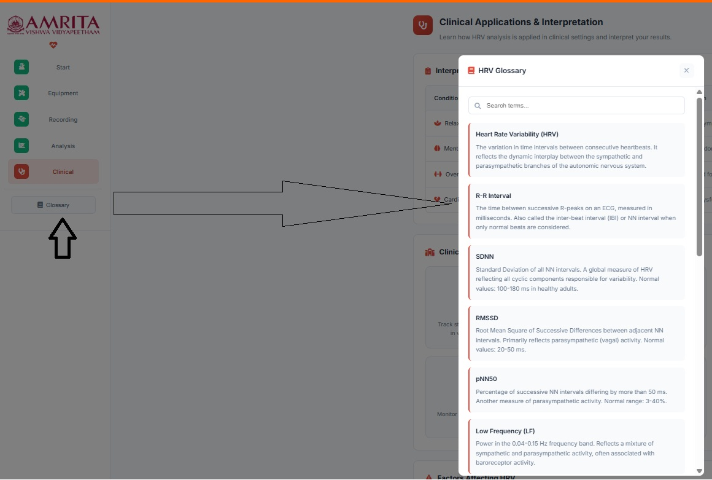

&nbsp;
 

