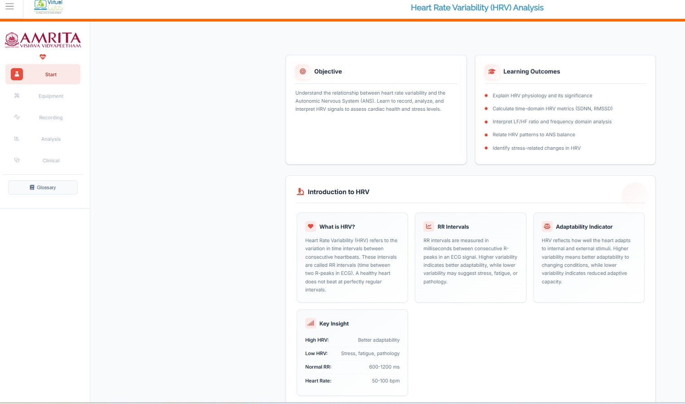

### Steps to work the simulator 

1. Click on the simulator tab to start the simulation. A short overview of the experiment is provided. Users can read and understand the experiment concepts before beginning the simulator. After understanding the concepts clearly, click on the “Begin Experiment” button.

  

&nbsp;

