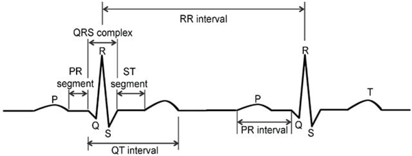

Complex and dynamic variability patterns are the common features of healthy biological systems, which the principles of Chaos Theory can describe. Heart rate variability (HRV) is a physiological phenomenon and a commonly used tool for assessing physiological stress and recovery in clinical cases, representing the time interval between consecutive heartbeats.  Heart rate is the number of heart beats per minute, and the heart rate variability represents the fluctuation in the time intervals between adjacent heartbeats, which varies from beat to beat. Integrating heart rate variability in psychophysiological research has been increasing in recent decades, as it represents the cardiac vagal tone index. That means that HRV represents the contribution of the parasympathetic nervous system to cardiac regulation. In other words, HRV is the measure of neurocardiac function which reflects heart–brain interactions and autonomic nervous system (ANS) dynamics.  HRV is extracted from an electrocardiogram (ECG), representing a measure of the variation in time between consecutive normal-to-normal R-R intervals on the electrocardiogram signals. 

&nbsp;

### Physiological Basis of HRV
The physiological mechanism representing the HRV is tight, yet complex, that couples between the brain and the body. The sinoatrial (SA) node, which is a bundle of specialised cells in the heart, is responsible for producing heartbeats.  The autonomic nervous system regulates multiple body functions such as respiration, digestion, and cardiac control, and acts as a neurologic control system.  The two branches, sympathetic and parasympathetic, interact continuously, shaping the heart rate variability.  The parasympathetic nervous system (PNS) relates to the resting condition and is regulated by the vagus nerve and central peripheral muscarinic receptors activated by the neurotransmitter acetylcholine. The sympathetic nervous system (SNS) is responsible for the fight or flight” response, and mostly the cardiac accelerators originate from the thoracic spine.  The physiological basis is that the SNS results in increased heart rate and decreased heart rate variability, while activation of the parasympathetic nervous system decreases HR and increases HRV.

&nbsp;

### Measurements of heart rate variability
ECG signals are time-varying electrical recordings of the heart, which have P-QRS-T waveforms to represent atrial and ventricular depolarization/repolarization. The heart rate variability measures the overall variation in instantaneous heart rate, as well as the intervals between successive QRS complexes (RR intervals) originating from normal sinus depolarizations. The RR intervals refer to measuring the time between two consecutive R-wave peaks on an electrocardiogram, which represents one full cycle of heartbeat.(Figure 1) 
&nbsp;

  
   
  <i>Figure 1. Components of an ECG signal Source: Mohd Apandi, Z. F., Ikeura, R., Hayakawa, S., & Tsutsumi, S. (2022, August). QRS detection in electrocardiogram signal of exercise physical activity. In Journal of Physics: Conference Series (Vol. 2319, No. 1, p. 012021). IOP Publishing.
</i>

&nbsp;

RR intervals are measured in milliseconds between consecutive R-peaks in an ECG signal. Higher variability indicates better adaptability, while lower variability may suggest stress, fatigue, or pathology. It is noted that the RR intervals of the QRS complex in the ECG are modulated at different frequencies based on the differential rhythmic contributions of sympathetic and parasympathetic autonomic nervous activities. To extract the heart rate variability from the HRV signal, various steps, including a structured signal processing, are required. The basis for analysing HRV is the modulation of the RR intervals, and its time domain, frequency domain, and non-linear techniques for analysis are required. 

&nbsp;

#### Time domain
The simplest method to quantify HRV is the time domain analysis. It provides statistical analysis on the intervals between successive normal heartbeats (RR intervals) recorded from an ECG machine. This measures the overall autonomic nervous system activity. The higher variability in heart rate indicates healthy autonomic functions, while reduced variability is indicative of stress, physical exercise, cardiovascular disease, or autonomic dysfunction. The common types of time domain metrices include Standard Deviation of NN intervals (SDNN), Root Mean Square of Successive Differences (RMSSD) and NN50 or pNN50. 

SDNN represents the standard deviation of all normal to normal (NN) signals obtained from an ECG signal which is measured in milliseconds. High SDNN indicates healthy autonomic function, while low SDNN represents autonomic dysfunction. RMSSD represents the mean square of the differences in adjacent NN intervals. The short term HRV is indicative of PNS activity and high value corresponds to strong vagal tone. It is commonly assessed in conditions such as mental stress. NN50 	indicates successive NN intervals with 50ms different and pNN50 represents its percentage.

&nbsp;

#### Frequency Domain
In frequency domain analysis, the RR intervals in the HRV signal is broken down into component frequencies using Fast Fourier Transform (FFT) or autoregressive modelling. This step helps in quantifying the contribution of sympathetic and parasympathetic nervous system activity at different frequency bands. Frequency-domain analysis involves breaking down the HRV signal (RR intervals) into its component frequencies using methods like Fast Fourier Transform (FFT) or autoregressive modelling.  The Low Frequency (LF) power represents the power spectrum density in the 0.04–0.15 Hz frequency range and is indicative of oscillations in heart rate in every 7-25 seconds. It represents the activity of the SNS and PNS under normal resting conditions. The high frequency (HF) power represents the power spectrum density in the 0.15–0.4 Hz frequency band and is primarily a representative of vagal activity. High HF power corresponds to strong vagal tone and stable autonomic flexibility. It is usually associated with respiratory sinus arrhythmia, where the heart rate increases during inspiration and decreases during expiration. Low values of HF power are associated with reduced parasympathetic activity, possible stress, fatigue, or cardiovascular dysfunction. The LF/HF ratio represents the influence of the sympathetic and parasympathetic nervous system and connects to the autonomous nervous system functions. 

&nbsp;

#### Nonlinear methods
The Nonlinear methods for HRV analysis detect subtle changes in autonomic regulation that are not visible with linear methods. The most common nonlinear HRV method is the Poincaré Plot, which provides a scatter plot of each RR interval versus the previous RR interval. The SD1 indicates the standard deviation that is perpendicular to the line of identity, and SD2 represents deviation along the line of identity. SD1 contributes to short-term variability (parasympathetic), and SD2 provides overall HRV. A wider and scattered plot indicates a healthy state. 

&nbsp;

### Clinical Applications
The HRV analysis was widely applied to clinical conditions such as Mental stress, myocardial infarction, heart failure, hypertension, diabetes mellitus, anxiety, depression, exercise and rehabilitation techniques, including sports science, cardiac rehabilitation, yoga and meditation. HRV is considered a noninvasive marker for cardiovascular health. 
